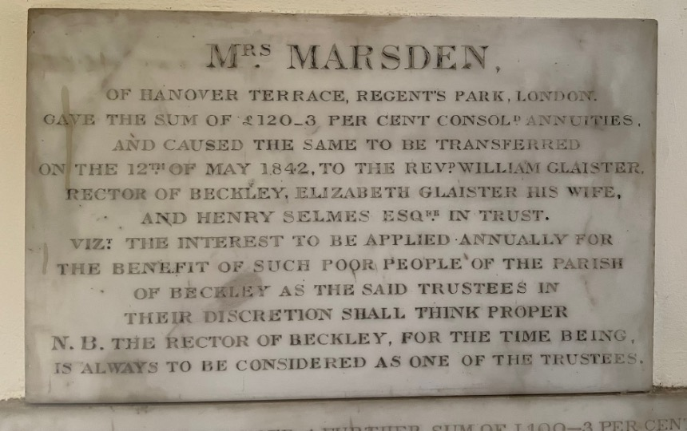
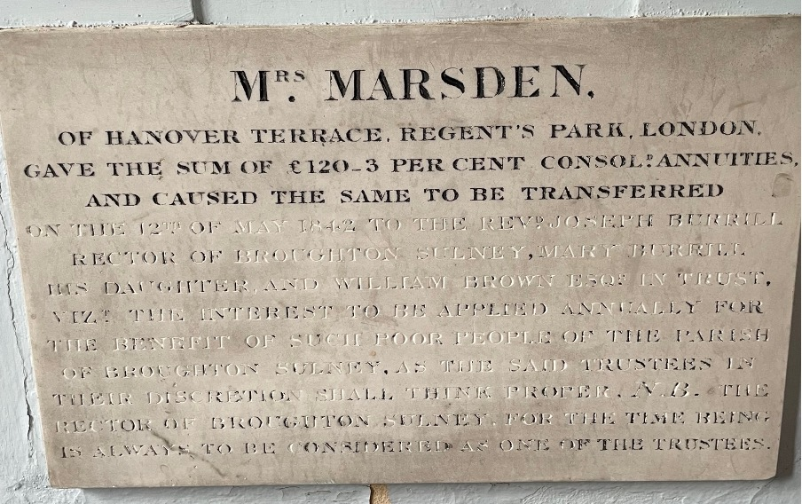
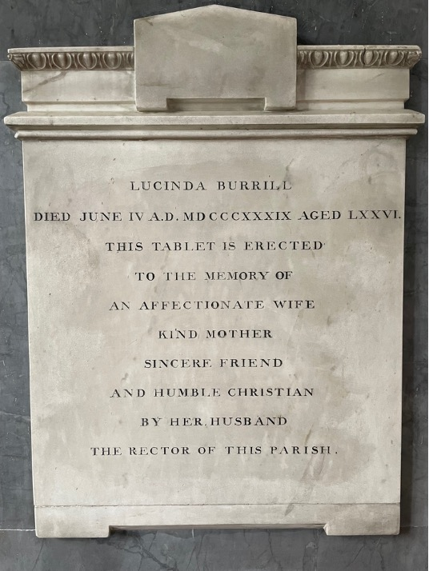
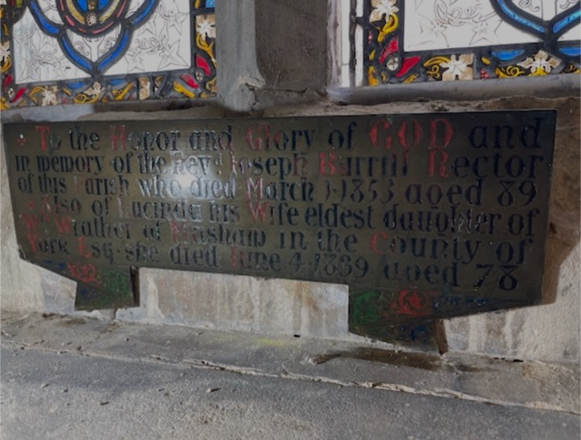

[Home](https://simon-scmp.github.io/Upper-Broughton-History/)

### The Connection between Upper Broughton, Masham and Beckley.

**Rev Joseph Burrill was a busy man. Until 1835 he lived in Masham in North Yorkshire where he was a curate, ran a Grammar School and a Boarding School and had a farm. From 1808 until his death in 1853 he was the Rector of Upper Broughton and received the rent from the glebe lands and church properties in this village which came to about £400 per year. When absent from Upper Broughton (1808-1835) he would have employed a curate to look after the good folks there.
Whilst holidaying in Kent last year we came across this plaque on the wall of Beckley Church:**

How strange to see this plaque, because in Upper Broughton (often referred to as Broughton Sulney) we have a very similar plaque:

And then I found a book online called ‘The history and antiquities of Masham and Mashamshire; together with an account of its several franchises, its ancient lords, rectors, prebendaries, vicars, curates, etc., etc.; and appendixes, containing copies of several charters, grants, and other important documents‘ by John Fisher of Masham.
In the book there is a reference to a similar gift being made in Masham :

*“Marsden's Charity. — Mrs. Marsden, of Hanover Terrace, Regent's Park, London, gave £220 3 per cent, consolidated bank annuities, and caused the same to be transferred on the 22nd February, 1842, to the late Rev. Thomas Riddell, Vicar of Masham, William Burrill, (now of Liverpool) and the late John Burrill in trust, viz : — the interest to be applied annually for the benefit of such poor people of the Parish of Masham, as the said trustees in their discretion shall think proper. — The Vicar of Masham for the time being is always considered as one of the trustees”*

So we have three churches all getting an endowment from a Mrs Marsden who lives at a very prestigious address in Regent's Park.
The connection would appear to be that Mrs Marsden, nee Wrather, was the sister of Lucinda Wrather who married Rev Joseph Burrill. They all came from Masham. Lucinda's daughter Elizabeth married the Rev William Glaister, the Rector of Beckley. Mrs Marsden was the wife of Robert Marsden who was a stockbroker. They were involved with many charities and these endowments to the churches in Masham (her birthplace), Beckley (where her niece’s husband was Rector) and Upper Broughton (where her brother in law was Rector) are an example of their generosity.

The book continues: *“The Rev. Joseph Burrill was born at Masham in 1764, and was the only son of the late Joseph Burrill of Masham (who died 23rd of October, 1806, aged 76 years) and Elizabeth his wife, (who died 29th of October, 1810, aged 75 years.) He, on the 20th of June, 1794, married Lucinda, daughter of the late William Wrather of Masham, by whom he had eight children, viz :— I. Charles, who died 20th July, 1802, aged 1 year. II. Wil- liam, now of Liverpool. HI. Joseph, who was a solicitor in Masham, and died suddenly on the 22nd of March, 1830, aged 34 years. IV. John, who, on Sept. 26th, 1826, married Anne daughter of the late James Blackburn of Masham, deceased, by whom he left issue. He died 14th June, 1846, aged 48 years. V. Thomas, who died 11th Sept., 1827, aged 24 years. VI. James. VII. Mary. VIII. Elizabeth, now the widow of the late Rev. William Glaister.
Besides being Curate of Masham, he was also, for very many years the Head Master of the Grammar School at Masham, and the proprietor of a very extensive Boarding School here, which, in its day, was held in very high repute. His predecessor, as Head Master of the Grammar School, was a Mr. Wilson ; and his immediate successor in it was Mr. Edmund Barker of Masham ; who has been again succeeded by Mr. Henry Stubbs, the present master.”*

An interesting excerpt from the same book discusses the situation at the church in Masham in 1791 when the Rev William Lawson arrived in Masham:

*“In the early part of Mr. Lawson's incumbency, whilst he was travelling in France, during the time of the war between England and that country, he was taken prisoner and detained there for a long time. On being liberated at the conclusion of the peace, he retired to Kirkby Malzeard, and there built him-self the present parsonage-house, and, having surrounded it with high walls, he shut himself up in it, and was rarely or ever seen afterwards, or at all events by his parishioners at Masham. The consequence was, that during his long incumbency of forty-two years every- thing connected with the parish and his cure was neglected, the sole charge of this wide and extensive parish being committed to his curate, the late Rev Joseph Burrill. Considering that Mr. Burrill during the time he so held the curacy was carrying on a large and flourishing boarding-school — was the Head Master of the Grammar School — and was at the same time personally managing a farm which he rented, it will be readily seen that he could not pay that attention to the spiritual concerns of the Parish, and of its inhabitants, which its importance demanded, or which ought to have been be- stowed upon it. Very few improvements were therefore effected in the church during this incumbency.”*

Given that Rev Joseph Burrell spent limited time on the parish in Masham, it is interesting to note that from 1808 he was also Rector of Broughton Sulney (Upper Broughton). Who looked after the good people of Upper Broughton until September 1835 when Rev Joseph Burrill renounced his curacy in Masham? Having served the people there for 50 years, they presented him with a silver tray and he moved south to the Rectory in Upper Broughton.
Lucinda died here in 1839 and there is a plaque in the chancel erected by her husband

Reverend Joseph Burrill died in 1853. They were both buried in the chancel in Upper Broughton church. But the chancel was rebuilt in 1855. So it is not known exactly where their remains are. There is a metal plaque to Joseph and Lucinda Burrell below one of the windows on the south side of the chancel:
 

 
They outlived several of their children who were buried in Masham and do have headstones.
Somewhere in Masham is the following:

**“In memory of the Reverend Joseph Burrill who died March 1st, 1853, aged eighty-nine years. He was forty-nine years curatej of this his native place, and late Rector of Broughton Sulney, Notts. Also of Lucinda his wife, eldest daughter of the late William Wrather of Masham, Esq. She died June 4th, 1839, aged seventy- six years. Their remains lie interred in the church of Broughton Sulney.”**
 
