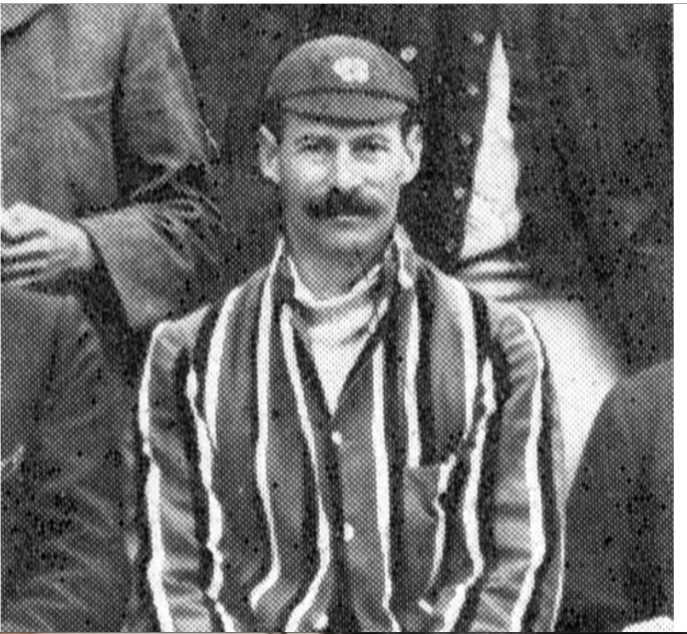
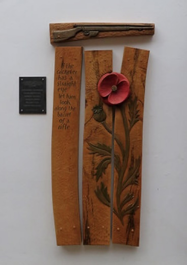

[Home](https://simon-scmp.github.io/ubhistdocs/)

## Rev. Harvey Staunton.

> As part of the commemorations to mark the centenary of WW1, the History Group published biographies of the eight men on our War Memorial. One man whose name is not there is Harvey Staunton. And we only learnt about him when Nottinghamshire County Cricket Club unveiled a new memorial to the six men who had played for Nottinghamshire and who died in the war. One of them was Harvey Staunton who had been the Rector of Upper Broughton between 1907 and 1911.

He was born at Staunton Hall, not far from Bottesford, in 1870. The Staunton family were given land there when they saved Belvoir Castle from being taken by William the Conqueror; the Staunton family history is exceedingly long. 
Harvey went to Bromsgrove School and then to Cambridge where he was awarded a Blue at Rugby. He became a curate, serving in Berkshire, Pleasley Hill and Plumtree and at the County Asylum in Nottinghamshire before arriving in Upper Broughton with his wife Mabel in 1907
A right-handed batsman, he played for the Notts Amateurs team and made 16 appearances for Notts as a batsman between May 1903 and July 1905. His highest innings was 78 against Middlesex at Trent Bridge in 1904. He also captained the Second XI for the 1909 and 1910 seasons.
In 1911 they left The Rectory in Upper Broughton and went to India where he worked as a missionary, before becoming the chaplain at Nagpur in Rajputana. From 1916 he served in Mesopotamia (modern day Iraq) as a Chaplain in the Army. He died of a fever in Arzizieh on 14th January 1918 and is buried at North Gate War Cemetery in Baghdad. The plaque below is at Trent Bridge cricket ground.

