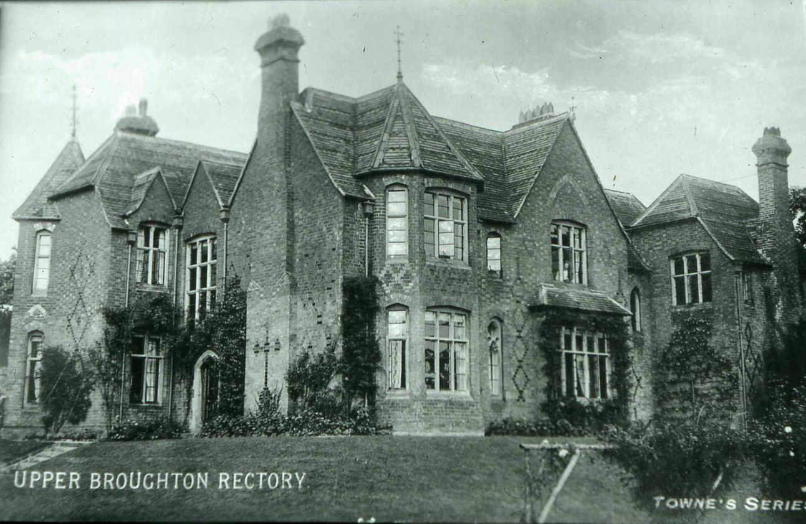
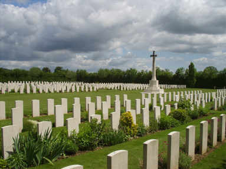
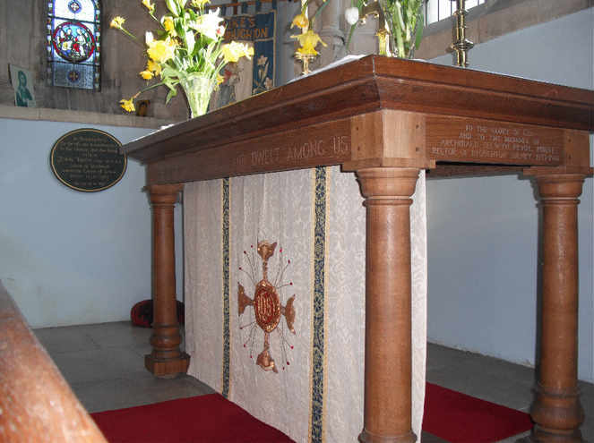

[Home](https://simon-scmp.github.io/Upper-Broughton-History/)

## Rev ARCHIBALD SELWYN PRYOR 

### Rector of Broughton Sulney 1933-1944
##### The Rector of Upper Broughton (often referred to as Broughton Sulney in ecclesiastical documents) was the only villager to be killed in the Second World War and his name is on the War Memoral in the churchyard.

Archibald Selwyn Pryor was born in London on 7th December 1902.he did his theological training at Westcott House and after he was ordained in 1927 he worked as a curate in Hackney. When he married Elizabeth Lister in 1933 he got the living of Upper Broughton where they happily settled; their six children were born there.

*The rectory in Upper Broughton in early C20th*

Reverend Pryor would go sledging with his children in the garden at the Rectory and also down Muxlow Hill. He was fond of riding and after taking an early service each day he would get on his horse and ride round the parish. He occasionally hunted with the Puckeridge in Hertfordshire where his family lived. At his own expense he sank a well and put up a windmill to pump clean water at High Holborn farm where the water supply was sparse and the children were always ill.

When the war came he had been granted a Territorial Army Commission in the Royal Army Chaplains Department as Chaplin to the Leicestershire Yeomanry. For a while he was stationed near Frome in Somerset and there is a story of a man bicycling about in those parts who saw a service taking place in an orchard and thought he might join in. to his surprise the Padre took his text not from the Bible, but from Punch magazine. He went to France ten days after D Day and he was killed near Caen on August 3rd 1944. He is buried in the little Charles de Percy War Cemetery.

*In Charles de Percy War Cemetery, France**
 
The church in Upper Broughton had an altar that was ‘a rather rough affair’, much altered to suit the requirements of succeeding rectors, so Mrs Pryor had made in his memory the rather beautiful one that is there now. It is inscribed:

>TO THE GLORY OF GOD
AND TO THE MEMORY OF
ARCHIBALD SELWYN PRYOR, PRIEST,
RECTOR OF BROUGHTON SULNEY 1933-1944
 

*Alter in St Luke's Church Upper Broughton*

The village also had a fourth bell cast in his memory.

“The Reverend Pryor was killed in Normandy in 1944. It was a tragedy, it is only this year (2012) that we learned the details of how he died… he is buried in one of the cemeteries in Normandy. We were devastated really. He was the only one to be lost in either of the villages… Mrs Pryor was given notice to quit in the November of that year, she had just given birth only a few weeks earlier with her sixth child”

***Audrey Jones***
