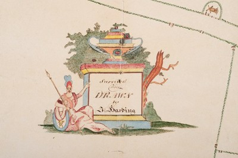

[Home](https://simon-scmp.github.io/Upper-Broughton-History/)

## Historical Maps
#### Recent copies of two historical maps

Two significant historical maps exist of Upper Broughton. One drawn by Brett in 1833 and primarily intended as a reference to the land holdings of the Brett family. Currently the original is held by the family in New Zealand.

The second map pre-dates this and was drawn by Harding in approximately 1820 this exquisite map is drawn on paper from J. Whatman from their Turkey Mills and dated 1818.

<base target="_blank">

You can see these maps below:

[The Harding map on Dropbox](https://www.dropbox.com/sh/6ya7qyqhsuppkws/AAB6K7l1T9ba3gkvpNHIk_O8a)

[The Brett map on Dropbox](https://www.dropbox.com/sh/clgbzuy5a28ubfh/AAA-KDiUaIq5Z5_ueGcPQjZVa)

