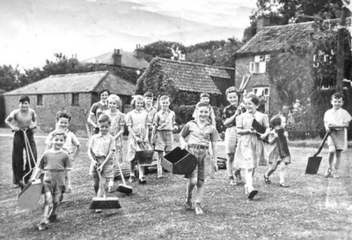

[Home](https://simon-scmp.github.io/ubhistdocs/)

## Bernard Pearson Hayes

The existence of the tennis club in Upper Broughton is entirely due to one remarkable man and to an unlikely coming together of circumstances.

Bernard Hayes was born in South Island, New Zealand in 1888 where his father had migrated in the nineteenth century. They were a pioneering family who built their own home and the community that grew up around them pooled their trades and talents to be self-sufficient. Later, the Hayes family developed a thriving agricultural machinery and hardware business.

Bernard learned to play tennis and developed a passion for the game, which endured, throughout his life. His ambition was to go to Wimbledon and this may have been amongst the motives, which caused him to enlist with the Anzacs when the First World War broke out in 1914.

After training, he was shipped to England – a long journey in those days. On landing they were taken to Salisbury Plain but after a very short stay they were ordered to France to relieve front line troops. His company came under heavy shelling and with typical colonial independence refused to go any further until after dark when they were less exposed. This however did not save Bernard from being wounded by flying shrapnel in the hip region. Worse was to come because on his way to the dressing station, both his stretcher-bearers were killed as they sheltered in a shell hole. Left helpless it was some time before he was rescued. The situation certainly called for strong nerves, which he must have possessed. He eventually reached base hospital where the shrapnel was removed and the wound being deemed a ‘blighty’ he was posted to an Officers Club as an orderly. It is difficult to imagine him in this role but the advantages must have convinced him that it was well worth his while to toe the line. Whilst in London he met the lady who was to become his wife and who went back to New Zealand with him at the end of the war.

The ensuing years passed in a successful business and full tennis career until another war broke out in 1939. Hayes once again volunteered as a rifleman, but he was too old for active service. When the war ended he and his wife embarked on a tour of visits to their relatives – some in Australia, some in Canada and the United States and some in England. An aunt of Mrs Hayes lived in a house facing Top Green (the west side of Greenhill Cottage). It was as a result of this fortuitous circumstance that they arrived in Upper Broughton in 1946. Because the aunt was in poor health, they stayed to look after her until she died. By now they were very much involved in village life so that when Mrs Hayes also died he decided to spend the rest of his life where he had put down roots.
In the long history of the village, there can be few characters that have made such an impact. Accustomed to hard work, he was soon offering assistance to the farmers, indeed to anyone in need of a helping hand.

He single-handedly created the play area on Cross Green, from what had been an area of rough, scrubby grass, and maintained it for over 25 years.

Using just a spade and a wheelbarrow, he cleared the whole area, levelled it, made a tilth, sowed grass seed, harrowed and rolled it, all by hand.  He made the posts and chains for the fence and all the original playground equipment for the children.   It originally still had a track through the middle but this was later closed to make it safer for the children.

He marshalled the children of the village into a gang to tidy up. As a result Upper Broughton won the competition for the ‘best kept village’ and was always in the running as long as he had anything to do with it. His tall, gaunt figure, often proudly topped with his Anzac hat was a familiar sight about the village.

What was missing was tennis! There was a court at the Rectory in Hickling and one at Dr Cuddington’s house in Long Clawson and one or two other private ones, but of course you had to rely on an invitation before one could get a game. It was not enough.

About this time (1949) Canon Weller was appointed to the Church at Upper Broughton. He had three sons and two daughters all in their teens. He was keen to form a club of which his own family would be the nucleus. Hayes of course found another outlet for his energies and was at the centre of future youth club activities. A very successful concert party became well known in the villages of the Vale. Hayes persuaded Colonel Holden who lived at Yew Tree House (to the left of the Golden Fleece) to allow the club to use his court one evening a week. This was better than no tennis, but not enough. This indefatigable man then, with the assistance of Jack Bailey, George Copley and Bill Eynon persuaded Major Victor Smith to give him some land across the road from his house and pay for one court. This generous but not entirely altruistic act ensured that there would be no building facing the major’s house. He was however a distinguished sportsman himself and enjoyed watching the tennis from an upper window of the house.

How the rest of the money was raised to pay for the other court remains something of a mystery. The basis came from people in the village ‘chipping in’ with £10 a head. Many charities were badgered and tapped. (One unlikely one was the Sunday Cinema fund, which had been created so that films could be shown in cinemas on Sundays). The posts supporting the netting surrounding the courts were put in by Mr Hayes in beds of concrete. He always did a thorough job – the ultimate in ‘do it yourself’.

 The pavilion was purchased for £50 from a defunct sports ground in Nottingham. A corrugated iron hut (demolished in 1991 when a skip provided by the contractors doing the re-surfacing needed filling up) with a bucket was provided for the “Gents”. The ladies had to manage (and did until 2003) with a primitive camping facility in the pavilion.
Much, indeed most of the work was done by Mr Hayes himself. The field was far from flat and a deep depression had to be filled with brick rubble to a thickness of some three or four feet. This has since provided excellent drainage under the various surfaces. The posts supporting the netting surrounding the courts were put in by Mr Hayes in beds of concrete. They were meant to stay put – as we found when a road drill had to be obtained to replace a post in the 1980′s. 

He also instituted friendly matches, taking on numerically superior clubs in Nottingham. As a result the club made many new friends notably from Wollaton and Chilwell clubs.
When the project was completed the courts were opened on the 23rd June 1952 by Mrs Victor Smith, who struck the first ball. My Hayes was in his 60′s at the time. He continued to play a good game with many guileful lobs until the age of 88 when he was awarded the Torch Trophy by the Playing Fields Association for services to tennis. He received the award from the England Cricket Captain Colin Cowdrey in a ceremony at the café Royal.

My Hayes died on April 25th 1979 (Anzac day) at the age of 91 in a nursing home in Newark and is buried in the Churchyard at Upper Broughton where in the latter part of his life he had contributed so much.

The original surface laid in 1951 was black tarmac. It was surrounded by green plastic netting. The latter was repaired several times but not replaced until 1991.
In 1963, one of the courts was treated with black bitumous paint to prolong the life of the surface. This work cost £51 although our records indicate that the ubiquitous Mr Bernard Hayes actually did the work.

The tarmac surface survived until March 1973 when a Gra-Green surface was laid on top by En Tout Cas at a cost of £1,015. This was the start of the “brushing era”.
The tennis courts were again resurfaced and refenced in the summer of 1991.
This is a poem composed by Kathryn Cruikshank following the funeral of Mr Hayes about a starling that flew round the Church whilst the funeral was taking place. When she retuned to the Church after the burial to free the bird she found it lying dead on the altar.

**The Starling**

>The altar candles flickered
>The lilies palely glowed,
>Sun though the window slanting,
>Flowers on the coffin strewed
>Suddenly a starling darted
>Swooped on the window frame
>Extinguished with the fluttering of his wings
>A single candle flame.
>The music sounded sweetly,
>The parson’s voice was clear,
>We mourned the end of an era,
>The loss of a friend most dear.
>We gave thanks for his life of service
>For his spirit brave and true,
>The starling quietly listened,
>Nor moved the service through
>“I’ll give the starling his freedom,”
>I thought as I went my way,
>“He shall fly in the wind and the sunshine
>Upon this burial day.”
>I came with a young companion;
>We walked with quiet tread;
>At the front of the altar frontal
>We found the starling, dead.
>We took it and laid it carefully
>Beneath the heavy clay,
>Where our friend in the wind and the sunshine
>Among the flowers lay.
>No more our friend will greet us,
>No more the starling sings,
>But earth and wind and sunshine still entreat us
>That we God’s praise should sing!*

*“Mr Hayes Was Upper Broughton.”*
**Sheila Hammond**

*“Everything he did was for children”
“…a wonderful engineer”
“…had the patience of Jobe”
“…made the Village Green single-handedly”*
**Dick Barrett and Michael Copley**

