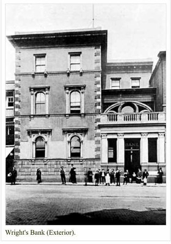
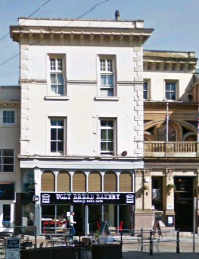
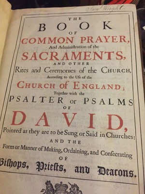
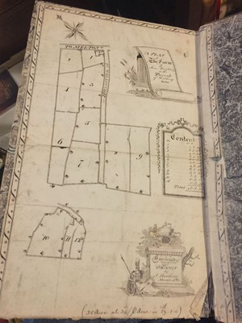

[Home](https://simon-scmp.github.io/Upper-Broughton-History/)

## Samuel Wright 

Samuel Wright is one of the latest people we are researching. New information has come to hand recently as we have been contacted by Charles Wright a relative of Samuel's and also Father Edward Martin who has Samuel's prayer book in his collection. We have also discovered two large slabs behind the Church which we believe lead to a vault where Samuel is buried. 

**Lieutenant Colonel Samuel Wright 1754-1839**

Samuel Wright was the son of John Wright and Ann Sherbrooke and was born on 18th October 1754.
Most of the road names in the village self-explanatory (Station Road, Chapel Lane, Rectory Drive etc) so where does the Colonels lane come from? It is probably named after Samuel Wright to whom there is a plaque on the south wall of the nave in the village church. He lived at ‘Broughton Cottage’ which is now Sulney Fields and he is described on the plaque as ‘Formerly Captain in the 15th Hussars and Lieut. Colonel Commandant of the Bunny Volunteers’. So presumably the lane leading to the colonel’s house came to be known as Colonels Lane.

No mention is made on the plaque of a wife.
Prior to moving to Upper Broughton, Samuel lived at Gunthorpe Lodge (a large house at the west end of Gunthorpe, near Lowdham, partly rebuilt in 1815). The house is no longer there, although Lodge Farm is and was situated behind the house itself. The Lodge had a chapel - more of that later…

In 1788 Samuel married Lady Anne Margaret Coventry, the daughter of the 6th Earl of Coventry. This lady had been married to a Mr Edward Foley and their subsequent divorce became a high profile case and was discussed in both houses of parliament. The story being sufficiently scandalous to earn her a chapter in the book ‘Scandalous Women’ by Elizabeth Kerri Mahok.

The parish records of Broughton Sulney (which is one of the original names for Upper Broughton) include the marriage of “Samuel Wright Esq Widower of the Parish of Lowdham & Ann Foulkes Spinster of this Parish by Licence 20th May 1825. Witnesses Thos Smith, John Holmes”. It would appear that Samuel must have relocated to Upper Broughton (as a widower?) and then married for the second time aged 60.

Wright's Bank (above) when it was the headquarters of the family bank. The Wright family had been merchants in Nottingham prior to opening the bank.
Samuel was a military man. He did not follow the family profession which was banking. Samuel’s father John Wright is mentioned on the plaque. He was a senior partner in Wright’s Bank in Nottingham. It was founded in 1761 and later they built these new premises on the right. The building is still there today (see below) and is now called Lloyd’s Bar and forms part of the Weatherspoon’s empire.

 

The Local Bunny Volunteers of which Samuel was the Lieutenant Colonel was formed in 1798. At the end of the 18th century Britain was at war with France and was also experiencing domestic dissent and rebellion, meaning the Army and Militia were stretched to maximum, so local volunteer forces were organised by the local gentry to defend themselves and their property. On one occasion the Bunny Volunteers marched to Mansfield to police the area and were billeted there for three weeks.

Samuel died without issue in 1839. The plaque says that Samuel was buried in a vault at the east end of the Church, so he was clearly a man of some importance.
His widow Anne remarried in 1846 in Upper Broughton Church. Her second husband was Thomas Brown a grazier from Nether Broughton who was 28. Anne was 41 at the time she married Thomas, but was widowed for a second time when he died in 1857. Anne died in 1866. We have recently discovered two massive stone slabs set into the grass behind the east window. The largest slab has 'SW 1839' in large letters and underneath it 'AB 1866'. The adjacent slab has Thomas's name and date of death. This must be the entrance to the vault that the plaque in church mentions.

Since we first wrote about Samuel Wright, we have been contacted by Father Edward Martin of Grimsby who is a collector of old prayer books. He had acquired a large lectern sized prayer book with Samuel's signature inside. The date of the prayer book is 1727 and has been well used, maybe it came from the chapel in Gunthorpe?

The prayer book also has some maps drawn in the back. They are by Harding and show a farm and its fields in the parish of HIckling. The farm was on the northern side of the junction of the A606 which leads to Nottingham and Folly Hall Lane, it is mentioned in Samuel's will together with the other farms he owned in Hickling:

*'I also give devise and bequeath all those my other freehold messuages and tenements with the close and appurtenances thereto belonging situate lying and being in the parish of Hickling in the said County of Nottingham and now in the occupation of Anne Collishaw John Hickling and John Marsh all of which I purchased of John Wild of Over Broughton aforesaid'*
Anne inherited the whole of Samuel's estate and continued living in Upper Broughton until she died. She didn't have any children.
