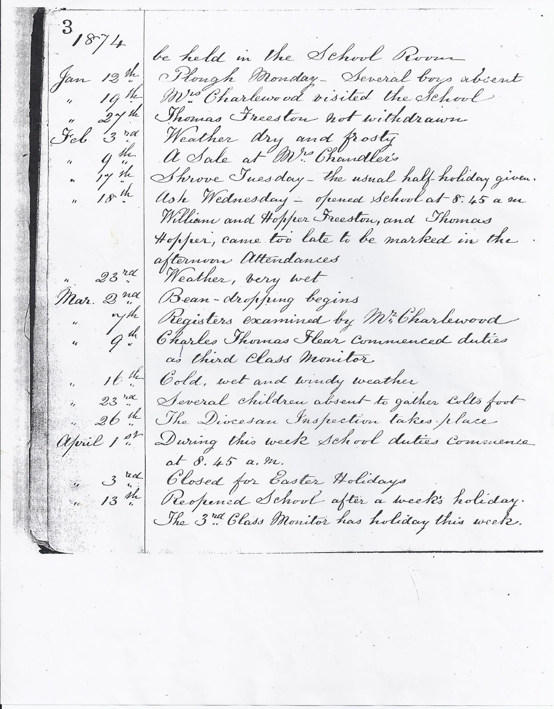

[Home](https://simon-scmp.github.io/Upper-Broughton-History/)

## A retrospective glance at education in Upper Broughton

### Education for the children in our Village today is taken as a given. It has not always been so. 

#### Historical Perspective 

Going much further back to earlier centuries, some education took place in informal Parish schools, or perhaps using an odd corner or porch of the church, where religion was taught from the Bible.  Children were taught to read, some in Latin.  
Kinoulton has possibly the second oldest school in Nottinghamshire, granted by Archbishop John Le Romyn in 1289.

Boys who were clever enough went on to a Grammar school, such as Southwell, which is Nottinghamshire’s oldest school and some who were able enough went on to Oxford or Cambridge.

Song schools were mostly found attached to the Cathedral cities and Grammar schools to market towns. (1)  

By the early 18th century there were several charity schools in Leicester. According to the local historian Nichols, the first Leicester charity school was one for 24 boys, conducted first by a Mr. Stephenson, and later by his daughters, and already existed in 1711.  In 1720 it was said that ten poor boys were being taught at Leicester at the cost of the Registrar, and ten poor girls at the cost of the Commissary.  A school for ten poor boys of St. Margaret's parish was established in 1716, but the boys seem to have been taught at the Free Grammar School on weekdays, and to have been separately instructed only on Sundays.  (2)

### Education in the 19th Century -- Dame Schools 

These were established in the 19th century, run mainly by women for local children. A small fee was charged and the education on offer varied greatly. Some Dame Schools were seen primarily as childcare whilst others offered a good foundation in the basics.  
Dame Schools were popular at this time and many parents who could afford the 3d. (1½ old pence) or so a week did so to give their child the very basic education on offer.  However, as agricultural children would have been able to earn and thereby contribute to the family income, this may have influenced parents’ decisions on school attendance.

***Sunday Schools***

At a Sunday School, children would have received some basic reading and writing tuition along with religious education. 

***National Schools***

These elementary schools were provided and managed by the Church    from the earlier half of the nineteenth century.  They were not set up everywhere and the nearest one to the village was in Nether Broughton, with further details below.

***Education in neighbouring Nether Broughton***

In the 1830s Sarah Severn started a school in The Manor House, Heckadeck Lane.  A few children from Nether Broughton attended as day pupils but most were boarders from other towns or villages.  In 1841 Miss Severn had nine boarders, all girls aged 9 – 15.  She died in 1850.
In the 1850s another school opened in Chapel Lane run by Anne Bennett and Frances Hopkins.  In 1861 they only had 1 boarder as there was probably another school in the village as well as in surrounding villages.  A National School was built in 1845 on Main Road.  The first headmistress was probably Sarah Taylor.  In 1861 Sarah Burrows and Jane Sansome were teaching there.
In 1871 about 95 children in the village were classed as scholars.  Not all attended school in Nether Broughton;  some may have gone to schools in Long Clawson or Old Dalby.
The Nether Broughton School closed and as described below, a new school was built in Upper Broughton, and Nether Broughton children were allowed to attend

***Upper Broughton before 1870***

From the 1851 and 1861 censuses, we can begin to see what was available for children in and around our village.  

In our village, the 1851 and 1861 census lists some 107 children who are described as “scholars” yet interestingly there is no evidence of a school in the village before the opening of the school on the main road in 1877, mentioned below.  We wonder where were they taught and by whom ?  It is probable that the majority only attended the Sunday School and worked on the land during the week!

However, from the Census of 1851 we know that there was a Dame Schoolmistress in our village called Sarah Skerrit (aged 71) who lived in David’s Lane (now known as Church Lane).  There is a record of a Dame School in the village, pictured earlier.  However, at the moment very little is known of this.  From the Census in 1861 a Sarah Daykin (aged 56) was recorded as a Dame Schoolmistress living in Church Lane.  We can perhaps assume that she ran a Dames School from her home.

The 1870 Education Act was a watershed:  it heralded in compulsory education and obliged local authorities to provide primary education for all children aged 5 to 11.

Before 1870, formal education was not available for most children.  Only the very rich or those whose parents were members of the Clergy would have had the opportunity for their children to receive a full education at a specific school.  (3)

***Upper Broughton in the 19th and 20th Centuries***

In the 19th Century, School Log Books reveal that the seasons had a huge impact on the attendance of children at the school as many of the children were the sons and daughters of local farmers and would be needed to help out at busy times such as harvesting.  Blackberrying was also given as one of the reasons for absenteeism!

It was also noted that many childhood illnesses, such as whooping cough, (spelt without a (w) in the log), scabies and impetigo spread rapidly and resulted in much absenteeism.  Of course, without the advantage of modern medicines, they posed a very real threat and were difficult to contain and to treat.

The following are extracts from the Kinoulton School Logs held at the Nottinghamshire Archives  and give some examples of both of the above. (4)   

Following the 1870 Education Act, in 1874 a school board was set up and subsequently at a cost of £2000 a school plus a schoolhouse was built, just within the county border in Nottinghamshire, situated on the A606 next to the cricket ground. This served children from both Nether and Upper Broughton and outlying farms and villages.  It was known as “Upper Broughton Council School”.  

As it had a board of governors it was also known as “Upper Broughton Board School.” 

The first headmaster was a Mr. Palmer.  He was employed at a salary of £60 per annum plus half of the Government Grant.  His sister was appointed as Serving Mistress and Teacher of the Infant’s department at a salary of £20 per annum.  They moved into the School House on the 28th May 1877.

The school opened on the 4th June 1877.

The average attendance at the School during the first few months was 100.

The children were taught in 3 classes - infants and lower and upper juniors. The curriculum seemed limited with reference to reading, writing, recitation of poetry, arithmetic, some history and singing.

However, as mentioned earlier, and detailed in the Kinoulton School Log Books, and Upper Broughton School Log Books,  attendance at School was erratic, governed not only by the seasons but also by the many childhood illnesses prevalent at this time. Parents were expected to pay a weekly fee for their child to attend school – between 2d for the younger children and up to 3d for the older ones.  This may well have impacted on attendance levels as some families simply couldn’t afford to send their children to school.     However, the Board had discretion to remit school fees for many of the families who were struggling to meet the cost and there are several entries in the Log Books showing they used their power on many occasions to do so. There are though still many entries showing that the ‘school attendance officer’ had been asked to call upon parents regarding non-school attendance.

In the Upper Broughton School Log Books the following National event is recorded (5)

“23.1.1901	I spoke this morning to the children for a short time about the mournful and melancholy event  - the death of our beloved Queen (Victoria).  The school blinds are half drawn in consequence of the sad event.”
“13.2.1901	In memory of the late Queen Victoria a framed photograph of Her Late Majesty has been obtained by permission of the Board and hung in the schoolroom.”
   

***Examples of the early Curriculum***

Object lessons for the infants formed a central part of their day. These included common everyday objects such as wild flowers, a dog, money, a candle, a cow plus things from outside their world like a lion, silk, a camel and an elephant.

Although in one annual report it states:

*“The infants show a deplorable ignorance of these”*

An amusing entry found in the Upper Broughton School log book dated 17.6.1898 with reference to object lessons.  It must have been quite a sight!

“Two Frenchmen called with a performing bear.  Thinking of a good opportunity of having a short object lesson on the bear, I allowed the children to stop the writing lesson and the school assembled in front of the building for the remaining quarter of an hour.  The bear was said to have been captured in the Pyrenees.” 

#### HEAD TEACHERS 

1877 – 1878 – Mr. Palmer

1878 – 1882 – Mr. Robert Wilson

1882 – 1884 – Mr. James Slimming

1884 – 1899 – Mr. George Hartley

1899 – 1929 – Mr. Joseph Marsden Walker

*One of the Head Teachers Joseph Marsden Walker (appointed 1st May 1899).  He was interested in music and drama.  A good singer, he sang at concerts in various village halls.   In 1900 he presented a play called “Robin Hood” at school.  Along with pupils, parents, the head and his wife took part (photo 1907)* 

1929 – 1934 – Mr. George Arthur Meakin

1934 – Temporary Head Teacher – Mr. Stanley Wakerley

1934 – 1964 – Mr. George Sulley 

In one annual report it is recorded that  

*“The headmaster (Mr. Sulley) has been in charge of the school for twenty years. As a mathematics specialist with previous experience in large secondary schools, he organises the work of his school on formal lines. Precision is natural to him and although the building lacks storage facilities, the headmaster with a fetish for tidiness sets an example of orderliness which is commendable. There is little concession to modern or freer techniques."*

1964 – July 1969 – Mr. Peter Bailey

September – December 1969 (When School closed) – Miss J. Burnand

**During World War II a number of children were evacuated to the Village and to the School**

The 1944 Education Act guaranteed free education for every child in England and Wales.  It divided schools into primaries and secondaries.  At the age of 11 the type of school they attended (grammar, secondary modern or technical) was determined by the completion of the 11+ test.
(8) 

**Upper Broughton Heritage Lottery Funded Oral History Project.**

You will know that this booklet has been funded by the Upper Broughton Heritage Lottery Funded Oral History Project.   One of the five themes of the three year project, started in 2011, featured the school and the education offered to village children. Many of the people we interviewed had vivid memories of the School.  They remembered particularly the Teachers and Head Teachers.  For most, they seemed to have enjoyed their schooldays, but there were a few who had a very different view! Their memories of the lessons, school outings and playground games were fascinating to listen to.  It was a privilege to share in their memories and we list below some of their quotes:-

*“We dreaded the annual visit to the school dentist”*  **Audrey Jones**

*“Mr. Sulley was very strict, he would say “if a blue pig with spots walks through the door just ignore it, look at me”* **Katherine Stokes nee Parkinson**

*“(I) didn’t like it (school) very much). Dad worked on the farm and he used to come home for his breakfast as men did in those days after they milked cows, and he would take me down to school.  By the time he had biked back up the hill I’d run home again.  But that only happened for a few days, but I remember deciding I wasn’t going to stay and I ran back up the hill and Dad had to take me back down again with much howling and carrying on”*  **Doreen Devoto**

*“Another day over another day nearer the grave”* – saying of Headmaster Mr. Sulley – **Michael Copley**

*“We played snobs at school, a game played with 5 stones”* **Rosemary Staples**  

*“We used to play statues and skipping…”* **Judith Thomas and Jane Braithwaite**

*“The two Misses Christian wore ear-phones round their ears (hairstyle!) One had blonde hair the other was brunette”* **Peter Burgin**

**Closure of the School**

Even though in the early 1960s many improvements and repairs to the school building were carried out and new books and PE apparatus arrived, in January 1965 at a meeting the school managers attended with the assistant Director of Education they were officially informed that a recommendation had gone forward for closure of the school. The managers "stated their intention to make representations to the appropriate authorities appealing for reconsideration of this proposal"

A newspaper cutting of the time States that *"Upper and Nether Broughton Primary School seems doomed to close stressing the difficulties in improving both sanitary arrangements and generally bringing the building in line with present day requirements"*

The school continued educating the local children until 19th December 1969. The remaining children transferred to Kinoulton with Mr Jankowski one of the teachers.  Mrs Burn and another teacher went to Trent Vale Infants.

The last days were very enjoyable with a party, a carol service and presents for each child.

The building has now been demolished.  

 *“Today we all know education is our basic right”*

We use this quote by the International teenage education campaigner [Malala Yousafzai](https://malala.org/malalas-story/), in 2013, as a fitting tribute to a brave young lady and yet we know that even in the 21st Century globally education is still not a given for all,

 ---

#### References:  

Gillard, D. (2011) Education in England:  a brief history

2.	A history of the county of Leicester, Vol 4  The City of Leicester 
R.A. McKinley (Editor)

3.	Living Heritage – 1870 Education Act – UK Parliament

4, 5 and 6	Nottinghamshire Archives

7.	Your Child at School by H. Mackenzie-Wintle – held at Nottinghamshire Archives

8.	op cit Living Heritage – The Education Act of 1944

#### Other Sources:

Thanks  to Jamie Price for her invaluable research

Our thanks also to the villagers of Nether Broughton for their generous sharing of their own memories and research

The Teaching and Learning of Music in the Settings of Family, Church and School:  Some Historical Perspectives
Gordon Cox  - University of Reading 

The National Archives – The Struggle for Democracy – Child Labour

BBC History – Victorians 

Royal Pharmaceutical Society – Victorian Pharmacy 

BBC Bitesize History – Public Health 1830 – 1930 

Playtimes :  A Century of Children’s Games and Rhymes – British Library 

Our thanks to the Heritage Lottery Fund for the grant which enabled the History Group to undertake the 3 year Oral History Project, producing 
the interviews, the 2 exhibitions and the 3 booklets.   

Thank you to the many villagers both past and present who kindly loaned the photographs and images reproduced here.

For those interested in learning more about 19th C education in Nottinghamshire, please see

“Education and Society in Nineteenth-Century Nottingham by 
David Wardle is available from Nottingham Library

And

“Village Children and the Non-Conformist Sunday Schools in Keyworth 1853 – 1914 by Howard Fisher 
available from Keyworth Library

