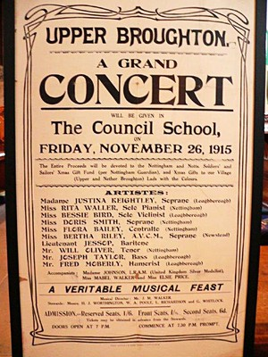

[Home](https://simon-scmp.github.io/ubhistdocs/)

## The First Christmas Concert for the Troops in 1915

### Review from the Grantahm Journal of December 4th 1915 of the concert held in the school:~

A Grand Concert was held on Friday November November 26th 1915 in the Council School in aid of the men from Nether and Upper Broughton who were serving in World War 1.
A poster advertising the event was found on a flea market stall in Melton Mowbray about ten years ago. The review is from the Grantham Journal of the 4th December 1915.
Concert poster 1915
‘With the laudable object of supplying Christmas cheer to soldiers, an excellent concert was given on Friday evening week, in the Council School, and Mr J M Walker, who acted as musical director, is to be congratulated on the splendid programme provided. He was ably assisted by Messrs H Worthington, W Poole, L Richardson, and G Whitlock, as stewards. The room was crowded with an enthusiastic audience and each performer received a hearty reception.

The concert opened with a pianoforte solo by Miss Rita Waller A.L.C.M. (Nottingham), who in this, as in the opening piece of part 2, gave great pleasure by her light touch and skilful manipulation.

Miss Bertha Riley A.V.C.M. (Newstead) gave excellent renderings of "Angus MacDonald" and "Il Bacio" using a powerful voice with good effect. Mr J M Walker contributed only one item but this, "John Bull's Catechism" was both patriotic and amusing and was given with zest. Two dainty little songs were sung by Miss Doris Smith (Nottingham) - "Until" and "Two Eyes of Grey". Several finely executed violin solos were contributed by Miss Bessie Bird (Loughborough) and evoked loud applause.

Madame Justina Keightley A.L.C.M. (Loughborough) was highly appreciated, her vocalisation of the song "In the Woods" being especially effective; she also sang with much expression "Your Heart Will Call Me Home". Apologies had to be made for the inability of Lieut. Jessop and Mr Joseph Taylor (Loughborough) to be present.

Mr Will Oliver of Nottingham, although, we believe, appearing for the first time on a Broughton platform, at once leapt into favour by his most effective rendering of the songs "An Evening Song" and "Nirvana". He was also associated with Madame Keightley in the vocal duet "Miserere" ("Il Travatore").

Miss Flora Bailey (Nottingham) who possesses a beautiful contralto voice, gave great pleasure in singing "Down the Vale"and "Three Beers and Tea". The humorous element was provided by Mr Fred Mobley (Loughborough), who caused intense amusement by his droll recitals and mirth-provoking songs. His graphic description of "Country Life" was particularly appreciated as was also his song "Logic".  The accompaniments were supplied by Madame Johnson L.R.A.M. (United Kingdom Silver Medallist), Miss Mabel Walker, and Miss Elsie Price (Loughborough).

It was one of the best concerts held here. The proceeds were devoted to sending Christmas parcels to twenty-one local soldiers, after deducting £5 for the Nottingham and Notts. Soldiers' and Sailors' Christmas Gift Fund. All the artistes gave their services freely, and they were generously entertained by the promoters of the concert. The proceeds accounted to £14 3s 6d, which, we believe, is a record for Broughton concerts.’