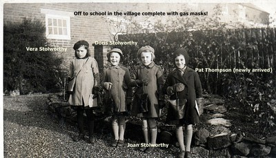

[Home](https://simon-scmp.github.io/Upper-Broughton-History/)

## Evacuees

#### Children evacuated from Great Yarmouth to Upper Broughton during WW2

In 1940, three teachers and forty children were evacuated from Northgate School in Great Yarmouth to Upper Broughton. Great Yarmouth was potentially a dangerous place. It had a submarine base and during World War II it suffered Luftwaffe bombing as it was the last significant place German bombers could drop bombs before returning home.

The children came by train to Melton Mowbray and then they boarded buses and were transported to various villages. Some children such as the Stolworthys had been told to stay together and all three duly arrived in Upper Broughton. Other families such as the Yaxleys got split up and the 4 Yaxley children ended up on different buses and then in different villages. Mr and Mrs Yaxley decided to take the matter in hand and they moved to Kinoulton from Great Yarmouth. Mr Yaxley got a job at Old Dalby depot and the family was reunited. One son Kenneth Yaxley had been living at Hillside Farm with Peggy Barnett and her parents. Kenneth died recently, he was living in Old Dalby, but visited Peggy whenever he was out following the hunt.

Mrs Thompson and Mrs Stolworthy followed their children to Upper Broughton and were employed as the maid and the cook at Yew Tree House. The three Stolworthy sisters and their cousin Pat 

Many of the children stayed until 1944 when it became apparent that it would be safe for them to return home. Some of them have returned to the village in the intervening years.

#### MEMORIES OF THE EVACUEES

**MARY JONES**:"I remember the evacuees more than anything… we had evacuees from Great Yarmouth, Auntie Sis and Uncle George had two – John Folkes and Frank Bezance. And they went back after the war."

**GRACE BROWN** (evacuee at Hill View)‘We had a lovely life out there, even though there was a war on’

**PEGGY BARNETT** (lived at Hillside farm with her parents: "We were sent down to the old school and they just dished us out with different girls and boys because they’d all left the coast, we just had to have what they gave us We had Donald Hubbard and he liked it with us that much he didn’t want to go home, we had to send him in the end after the war telling him he was going for a holiday and then send his clothes on no Donald lived with us for years and we kept in contact for a long time"

**DONALD HUBBARD** (evacuee with the Barnetts at Hillside Farm): "I enjoyed being on the farms, Mr Barnett learnt me to milk by hand. And I used to fetch the cows about 12 of them from a field up near the station….. Myself and another boy from Great Yarmouth called Kenneth Laxley were picked by Mrs Barnett’s daughter Peggy, other boy was not with us very long. The food we had was very good, they used to have a one of the pigs killed by Mr Bailey the butcher so we had plenty of meat which was salted and hung in the kitchen."

**MAUREEN HUNN** (née Brown, evacuee at Hill View with the Avery family) "I used to go blackberrying, we were very lucky"

**FRANK DREW** (evacuee at Bramley Cottage with the Goodsons) "We kept rabbits and we went to the Rectory because he had a buck and we had a doe. The Rector would say ‘Have they started foxing?"

**FRANK BEZANCE** (evacuee at Pond Farm)  "We went into the school at Upper Broughton for something like a mock auction, names would go on to the blackboard, a lady would look us over, names would be removed and it would start again, but at some point it was all solved"

**LEONARD NIGHTINGALE** (evacuee at Willow Farm with the Wooley family) "Kenneth MacMillan was also at Upper Broughton for a short while, but his parents took him back home"

**JILL FEARNLEY** (née Stolworthy, evacuee at Yew Tree House) "Mother had insisted that her girls must remain together, they were not immediately selected by any of the lady volunteers and it was very fortunate indeed that Diana Holden offered to take the girls to her family home -Yew Tree House."

**JOHN FOLKES** (Evacuee at Pond Farm) "I didn't want to go home"

 

#### WHAT DO THE EVACUEES REMEMBER?

They all went to Broughton School. Once they were 11 they went to secondary school in Melton Mowbray.

Leonard Nightingale left school and went to work at Melton Station as a Parcels Clerk before moving to Upper Broughton and then Old Dalby stations.

A lady at the White House used to cut children’s hair by placing a bowl on their head and cutting round it.

Film shows in the Village Hall and going to films such as ‘The Life and Death of Colonel Blimp’ shown by American soldiers at Old Dalby Camp.

Many of them had part-time jobs such as delivering the papers in Upper and Nether Broughton, pumping the bellows for the church organ, helping on the farms.

The station master used to eat cold baked potatoes, he said they were just like bananas (which were unavailable in the war)

Playing cards at Auntie Annie’s whilst waiting for the bus

Cycling to Langar airfield to watch the Lancaster bombers taking off

 

#### THE FAMOUS EVACUEE

[Kenneth MacMillan](https://en.wikipedia.org/wiki/Kenneth_MacMillan) came as an evacuee, but did not stay here very long. There are conflicting reports on how long Kenneth MacMillan stayed in Upper Broughton, it could have been any time between 4 and 14 days. He subsequently became a ballet dancer and is best known as a Choreographer, for discovering the dancer Darcy Bussell and for being the Artistic Director of the Royal Ballet.

His biographer Jann Perry wrote: ‘Kenneth and his Northgate Junior schoolmates were transported to the small Nottinghamshire town of Upper Broughton, not far from Melton Mowbray and a long way from Yarmouth. They gathered in the Village Hall, luggage labels bearing their names and addresses hung about their necks, waiting to be selected by local families. Kenneth, an urban child, ended up on the farm, where the farmers wife bathed him in a rainwater butt – or so he reported indignantly to his friends when he left Broughton after just a couple of weeks. He had written to his mother threatening suicide if she did not come and take him home at once. He was justified in being confident of his mother's love and of his power over her. Instead of telling him to stick it out in Broughton with his schoolmates, Edith fetched him back to Yarmouth - unwittingly exposing him to an onslaught of bombing raids as the Battle of Britain began.

Leonard Nightingale was billeted with Kenneth at Willow Farm with the Woolley family and has no recollection of either boy being bathed in a rainwater butt, so it was possibly used as a ruse by young Kenneth to get home. He died in 1992, backstage at the Royal Opera House, during a performance of his work Mayerling.
