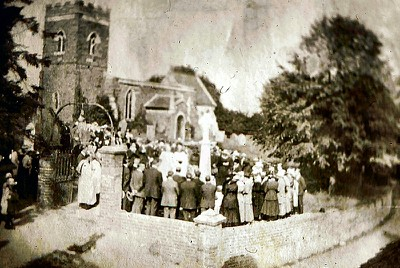

[Home](https://simon-scmp.github.io/ubhistdocs/)

The Upper Broughton War Memorial
Inscriptions from WW1 and WW2

 

**Upper Broughton Churchyard**

The names below all appear on the Upper Broughton War Memorial. sadly the first two names are of two brothers, William and Leonard Brooks. The picture above was taken on the day the memorial was dedicated. Neither the large tree in the churchyard on the right hand side or the light over the church gate are there now.

[**War time Photos**](https://www.dropbox.com/sh/nm9xrghj663n10e/AABGHh7WrasUqAhb30bpvjqca)
*Opens DropBox Gallery*

****

<aside>
<table>
<tbody>
<tr>
<td colspan="6">
<h2>World War 1</h2>
</td>
</tr>
<tr>
<td>

<b>Name</b>

</td>
<td>

<b>Born</b>

</td>
<td>

<b>Served</b>

</td>
<td colspan="2">

<b>Died</b>

</td>
<td>

<b>Further   Information</b>

</td>
</tr>
<tr>
<td>

William   James Brooks

</td>
<td>

1890

</td>
<td>

Gunner.   308th Siege Battery Royal Garrison Artillery

</td>
<td colspan="2">

30th   October 1917, Lijssenthoek Military Cemetery

</td>
<td>

Husband   of Mabel Brooks, Chestnut House, Lincoln. Son of William and the late Julia   Brooks, Corner House Farm, Upper Broughton (coal merchant)

</td>
</tr>
<tr>
<td>

Leonard   Morton Brooks

</td>
<td>

1892

</td>
<td>

Private   2nd/4th Battalion Duke of Wellington Regiment

</td>
<td colspan="2">

20th   July 1918. Soissons Memorial

</td>
<td>

Son   of William and the late Julia Brooks, Corner House Farm, Upper Broughton   (coal merchant)

</td>
</tr>
<tr>
<td>

John   Edward Keys

</td>
<td>

1897

</td>
<td>

Private.   No 2 Company Machine Gun Corps

</td>
<td colspan="2">

19th   August 1916. Caterpillar Valley Cemetery

</td>
<td>

Son   of John&nbsp; and Jane Keys,

15   Mansfield St., Nottingham

</td>
</tr>
<tr>
<td>

Sidney   Tuft Payne

</td>
<td>

1893

</td>
<td>

Private.   1st/7th Battalion, Duke of Wellington Regiment

</td>
<td colspan="2">

12th   March 1918. Wimereux Communal Cemetery

</td>
<td>

Son   of Emily and the late Andrew John Payne, Station House, Upper Broughton

</td>
</tr>
<tr>
<td>

Harry   Leonard Hourd

</td>
<td>

1899

</td>
<td>

Private.   2nd Battalion Worcestershire Regiment

</td>
<td colspan="2">

24th   September 1918. Five Points Cemetery

</td>
<td>

Son   of Agnes Winifred and the late Robert Hourd. Nottingham

</td>
</tr>
<tr>
<td>

Francis   Charles (Frank) Woolley

</td>
<td>

1895

</td>
<td>

Corporal.   2nd Battalion Kings Royal Rifle Corps

</td>
<td colspan="2">

23rd   October 1918 Vis-en-Artois Memorial, Panel 9

</td>
<td>

Son   of Frances Woolley, Farmer. Main St Cotgrave

</td>
</tr>
<tr>
<td>

Frank   Ecob

</td>
<td>

1898

</td>
<td>

Private.   2nd Battalion Lincolnshire Regiment

</td>
<td colspan="2">

21st   March 1918. Pozieres Memorial Panel 23

</td>
<td>

Son   of Charles and Addie Ecob, Main Road Upper Broughton (shoemaker)

</td>
</tr>
<tr>
<td>

Ralph   Marson

</td>
<td>

1891

</td>
<td>

Private.   2nd Battalion Duke of Wellington Regiment

</td>
<td colspan="2">

21st   September 1918. St Sever Cemetery Extension

</td>
<td>

Son   of George H and Elizabeth Marson, Newsagent. Top Green Upper Broughton

</td>
</tr>
<tr>
<td colspan="6">
<h2>World War 2</h2>
</td>
</tr>
<tr>
<td>

Archibald   Selwyn Pryor

</td>
<td>

1903

</td>
<td>

Chaplain   4th Class, Royal Army Chaplain Department

</td>
<td>

3rd   August 1944.

St   Charles de Percy War Cemetery

</td>
<td colspan="2">

M.A.   (Cantab.)

Husband   of Elizabeth Gulielma Pryor. Rector of Upper Broughton. Son of Selwyn and   Margaret Pryor.

</td>
</tr>
<tr>
<td> </td>
<td> </td>
<td> </td>
<td></td>
<td> </td>
<td> </td>
</tr>
</tbody>
</table>
</aside>