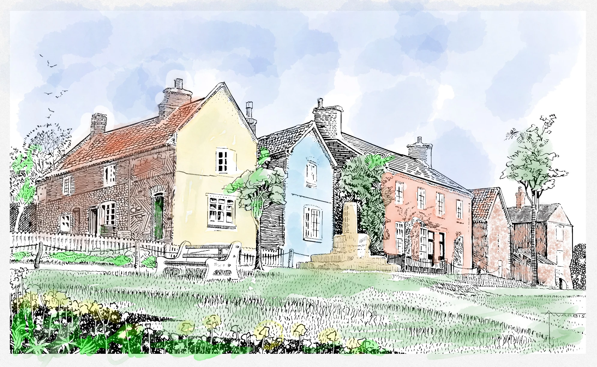
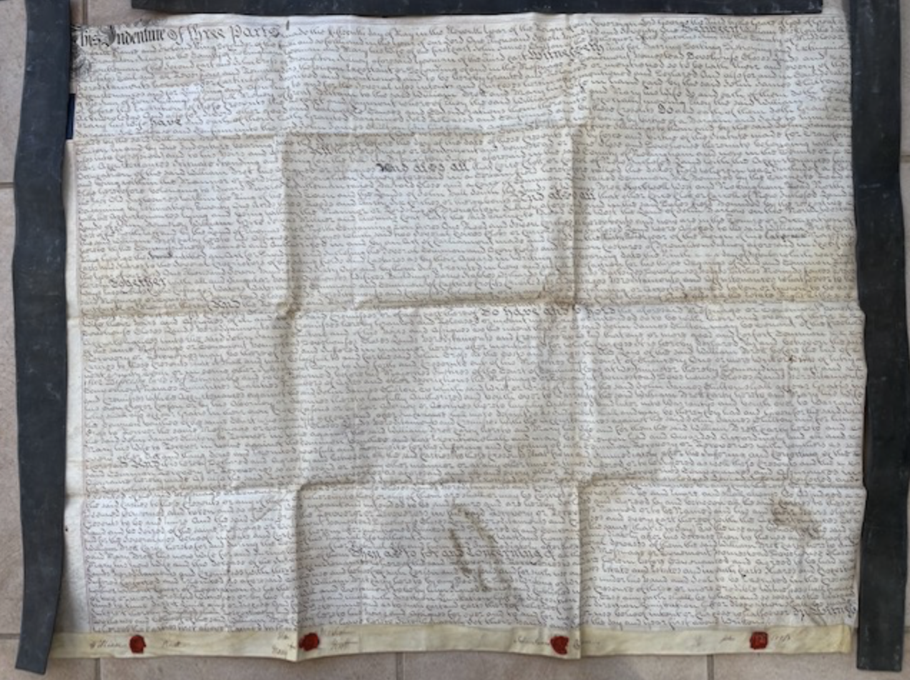
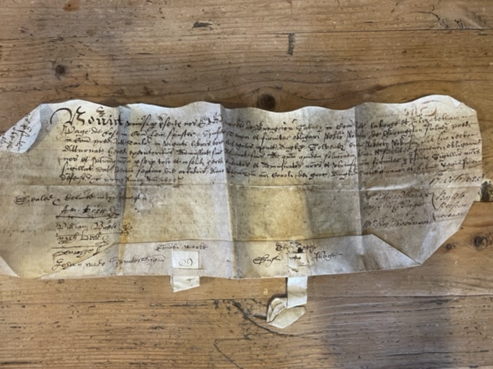

## Upper Broughton History Group

[Home](https://simon-scmp.github.io/Upper-Broughton-History/)

---
## [Home](index.md) | [Events](/Events/events.md) | [History](/History/walking.md)
## [Maps](/Maps/maps.md) | [People](/People/people.md) | [Farming](/Farming/Early_Farming.md)
## [Trades](/Trades/Baileys.md) | [Faith](/Faith/faith.md) | [Travel](/Travel/railway_accident.md)
## [Wars](/Wars/wars.md) | [School](/School/School_History.md)

---

# Welcome to the Upper Broughton History Group

>The Upper Broughton History Group is a community project set up to research, archive and present the local history of the village and surrounding areas.

*Cross Green and Top Green, taken from an original drawing by Mr A T Warbis in the early 1960's. Reproduced here by kind permission of his family. Recoloured. SC*

---

### A walk arround Barrow-upon-Soar
Photos from the tour 1 May 2025.
[Link to Google Photos Gallery](https://photos.app.goo.gl/asoQ2nK2aGNHMv9A9)

On a glorious sunny evening we were lucky to be given a guided tour of **Barrow on Soar by Kathryn Timmins and Sue Hobbs**. Most of us had driven through the village many times over the years yet never discovered the Church, the old Fox Inn, Beveridge Street, Shooting Close Lane and many other gems. It is lucky to have a railway station and sits alongside the River Soar and the Grand Union Canal.'

---

## The Broughton Chest - Discovered here in Upper Broughton

*We had an exciting find in the village and set up a working party to delve into the contents of an old metal trunk full of papers. We know that it came out of Broughton House in the mid 1970s and contains 250 documents, some of which are almost 400 years old. We are very pleased to hear that [Nottingham University Archives](https://www.nottingham.ac.uk/manuscriptsandspecialcollections/collections/allcollections/university.aspx) are going to accept these records into their archive, to ensure their future preservation and access for researchers. They would not ordinarily take documents such as these, as they fall outside of their Acquistions Policy, however, as they house the Clifton Family and Estate Papers and other material of a similar nature, and it is clear that many of our documents relate to areas local to these, it would make the most sense that researchers interested in these places are able to access records in the same archive.*

### The Broughton Chest

A large metal trunk of documents has come to light, it came out of Broughton House when it was sold in the 1970s and became a private house. Broughton House had been a farm, latterly the Worthingtons had farmed there; at least one of the documents mentions the Worthingtons. Before them four generations of the Brown family had lived there. Four William Browns. One of them had a lace factory in Nottingham, others became farmers and their names feature on many of the documents. Other names that are scattered across the documents are Daykin, Gregory, Peit/Peet, Turner, Cross, Mackley, Robinson, Brett, Redfern, Wright… and many more.

Most of the documents are legal documents, some of them dating back 400 years. They mainly appear to concern land transactions, but there are wills and other legal matters. A handful are in Latin, some are very large with huge red wax seals and some are easier to read than others. Only 3 of them contain a map, otherwise there are long descriptions of where the land was and who owned neighbouting plots. Land is clearly very important, houses less so. No houses are mentioned by name.

What they all have in common is that they are important historical documents relating to the village… As well as being lodged at the University we are also looking at making them available on this website.

[link to Hi-res external version](https://drive.google.com/file/d/1BgCuPgpLaJxIizVXMB41hyct79dm4saH/view?usp=sharing)

Before they are despatched go to the archives, we believed it was crucial that we recorded exactly what each document was about. In January 2023 a team of volunteers worked on the documents every Tuesday afternoon in the Village Hall. We:

Recorded who and what each document related to, recording such things as dates, all the names that appear, what it relates to etc. This information was input onto a PC into an Excel spreadsheet so that the information is searchable.
Scanned or photographed every document.

[Link to Hi-Res external document](https://drive.google.com/file/d/1qJwWfbXcz_hpzKzPiK-2013sXPf_G7NS/view?usp=sharing)

We recived funding for a laptop from the Upper Broughton Parish Council and also from Tina Combellack our Borough Councillor. The Village Hall Committee kindly allowed us to use the hall at no cost. If you would like to know more about this exciting project, please contact either Rosemary on 07946 547298.

[Nottingham University Archives](https://www.nottingham.ac.uk/manuscriptsandspecialcollections/collections/allcollections/university.aspx)

