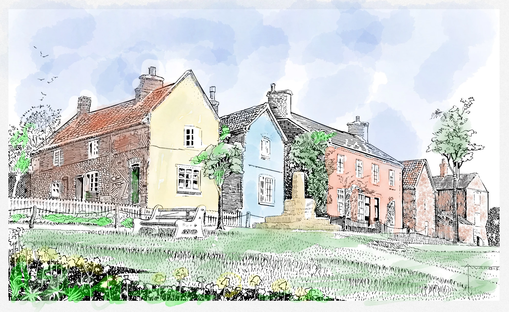
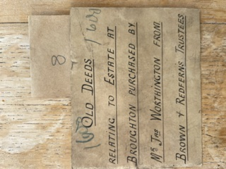
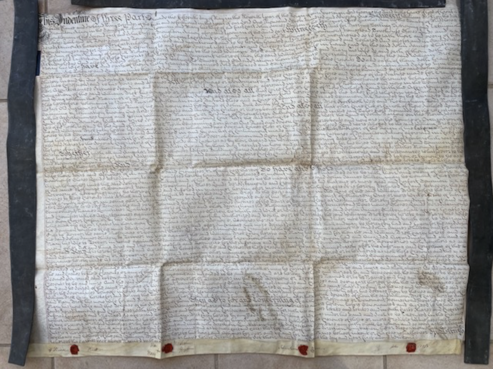
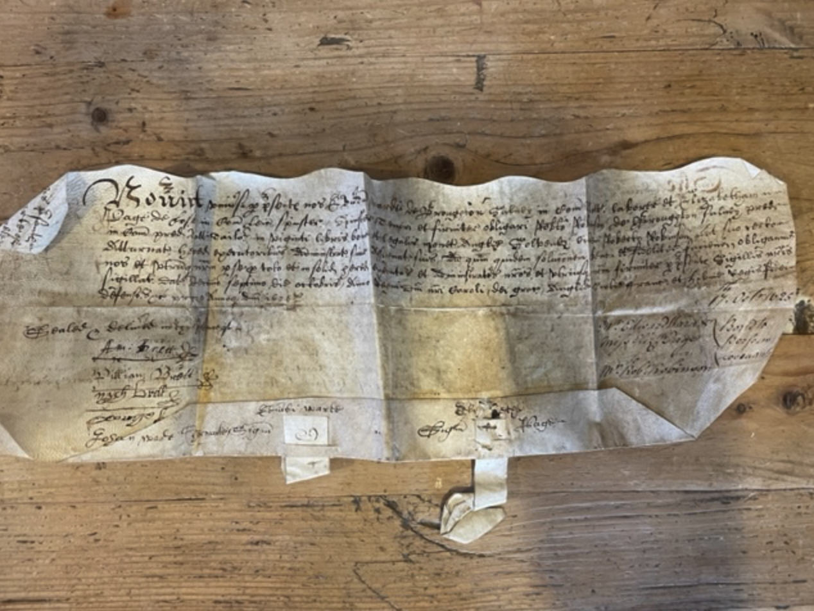

## Upper Broughton History Group

[Home](https://simon-scmp.github.io/Upper-Broughton-History/)

---
## [Home](index.md) | [Events](/Events/events.md) | [History](/History/walking.md)
## [Maps](/Maps/maps.md) | [People](/People/people.md) | [Farming](/Farming/Early_Farming.md)
## [Trades](/Trades/Baileys.md) | [Faith](/Faith/faith.md) | [Travel](/Travel/railway_accident.md)
## [Wars](/Wars/wars.md) | [School](/School/School_History.md)

---

# Welcome to the Upper Broughton History Group

>The [Upper Broughton](https://maps.app.goo.gl/Km2PybxVpB7F3BC1A) History Group is a community project set up to research, archive and present the local history of the village and surrounding areas.

*Cross Green and Top Green, taken from an original drawing by Mr A T Warbis in the early 1960's. Reproduced here by kind permission of his family. Recoloured. SC*

---
## Broughton Chest Documents.

 The documents were taken to [**Nottingham University's Manuscripts and Special Collections department**](https://www.nottingham.ac.uk/manuscriptsandspecialcollections/index.aspx) on 21 July 2026. Here are three final photographs.
 We checked through them all yesterday and packed them into boxes as the University does not have space for the trunk. Because we have indexed them they will be available immediately to anyone who wants to study them.

 Several of you have asked for a [**copy of the spreadsheet** (*Google Sheets link*)](https://docs.google.com/spreadsheets/d/e/2PACX-1vQJWU9BENNtd0V_8ob1yiLnARMb-v56g78K7vkBBx43GgOUmuR-jLwUTTpy8Wh0CKouvRowMyjwhpyl/pubhtml?gid=451156838&single=true
 ) which we emailed to the University yesterday. I should warn you that if you want to print it out it will run to 50 sides of A4. All our own work.

 Very many thanks for all your help with this project. It was a job well done and one we can be proud of being a part of.
 

 
---
## A Visit to the University of Nottingham to learn more about the Anglo-Saxon Cemetery at Broughton Lodge
### [Tuesday June 30th at 10.30am](Events/events.md)

---

## Vernemetum

#### Vernametum and the Upper Broughton History Group

In a first for the History Group we ran out of chairs when Peter Liddle came to talk about the Roman settlement of Vernametum which lay between Upper Broughton and Willoughby on the Wolds. It was small and whilst it never rivalled Leicester with it’s Roman baths (the Jewry Wall) still standing; a keen metal detectorist has uncovered hundreds of coins, brooches and other artifacts. The settlement lay on the Fosse Way, south and west of its junction with the Upper Broughton to Willoughby Road. and Peter is planning to take the [Leicester Fieldwalking team](https://leicsfieldworkers.org/) complete with some ground penetrating radar equipment to the fields to do further exploration, so watch this space….

What we do know more about is the Saxon burial ground that was excavated in the 1960s when the flyover was built. The Saxons came after the Romans. Most of that burial ground is in the field that you circle as soon as you leave the A46 when travelling north and head for Upper Broughton. It’s a very innocuous piece of land. But coincidentally it is the subject of an [exhibition at the Lakeside campus of the University of Nottingham from Fri 30 Jan – Sun 12 Jul 2026](https://www.lakesidearts.org.uk/exhibition/the-anglo-saxon-cemetery-at-broughton-lodge-willoughby-on-the-wolds/). The quality of the grave goods is exceptional (like the piece above). Some of the articles are usually displayed at the University and others have been quietly sitting in a store room near Nottingham Castle, but finally after 60 years they are reunited. That’s the fascinating thing about history you start off looking at one thing (like the Romans living locally) and end up with a burial ground for 120 dead Saxons, 4 horses and a wealth of grave goods. 

---

## Previous Events:

### Vernemetum

**7pm in Upper Broughton Village Hall**

In Roman times, between Upper Broughton and Willoughby-on-the Wolds stood the town of Vernemetum. It was one of a regularly-spaced network of towns in Roman Leicestershire.

The extent of the Roman settlement is not known, but small finds of tile and building materials have been turned up around the site of the cross-road at Broughton Lodge for a number of years; unpublished excavations conducted in 1948, recovery operations during road construction in 1963 and further unpublished excavations between 1964-66 all uncovered limited finds including mid-2nd and 3rd century pottery from buildings, hearths and pits along the line of the Roman road

We welcome Peter Liddle MBE - former County Archaeologist for Leicestershire – back to talk to us about the settlement.

In 55-54 BC, Julius Caesar visited Britain and established trading and treaty relationships with native Celtic tribes, including the Coritani in this area. Nearly 100 years later, the Roman army invaded the Country in the summer of 43 AD, and the long Fosse Way was built from Lindinis (Ilchester) to Lindum (Lincoln). It was one of the most major of main Roman roads. At a point one day’s steady march north of Leicester, a rest station was constructed, called Vernemetum. Some scholars favour its site as close to and north east of Willoughby on the Wolds, which, as a settlement, probably didn’t exist at the time. It lay between the regional capital, Ratae Coritanorum (Leicester), and the defended settlement of Margidunum (Castle Hill, near East Bridgford).
With thanks to the Wolds History Group for this information.

Peter Liddle worked for over 40 years as an excavator, survey officer, museum curator, community archaeologist and Head of the Leicestershire County archaeological team. Peter is an entertaining and knowledgeable speaker and we have enjoyed several of his lectures here in Upper Broughton. 

---

### A walk arround Barrow-upon-Soar
Photos from the tour 1 May 2025.
[Link to Google Photos Gallery](https://photos.app.goo.gl/asoQ2nK2aGNHMv9A9)

On a glorious sunny evening we were lucky to be given a guided tour of **Barrow on Soar by Kathryn Timmins and Sue Hobbs**. Most of us had driven through the village many times over the years yet never discovered the Church, the old Fox Inn, Beveridge Street, Shooting Close Lane and many other gems. It is lucky to have a railway station and sits alongside the River Soar and the Grand Union Canal.'

---

## The Broughton Chest - Discovered here in Upper Broughton

*We had an exciting find in the village and set up a working party to delve into the contents of an old metal trunk full of papers. We know that it came out of Broughton House in the mid 1970s and contains 250 documents, some of which are almost 400 years old. We are very pleased to hear that [Nottingham University Archives](https://www.nottingham.ac.uk/manuscriptsandspecialcollections/collections/allcollections/university.aspx) are going to accept these records into their archive, to ensure their future preservation and access for researchers. They would not ordinarily take documents such as these, as they fall outside of their Acquistions Policy, however, as they house the Clifton Family and Estate Papers and other material of a similar nature, and it is clear that many of our documents relate to areas local to these, it would make the most sense that researchers interested in these places are able to access records in the same archive.*

### The Broughton Chest

A large metal trunk of documents has come to light, it came out of Broughton House when it was sold in the 1970s and became a private house. Broughton House had been a farm, latterly the Worthingtons had farmed there; at least one of the documents mentions the Worthingtons. Before them four generations of the Brown family had lived there. Four William Browns. One of them had a lace factory in Nottingham, others became farmers and their names feature on many of the documents. Other names that are scattered across the documents are Daykin, Gregory, Peit/Peet, Turner, Cross, Mackley, Robinson, Brett, Redfern, Wright… and many more.

Most of the documents are legal documents, some of them dating back 400 years. They mainly appear to concern land transactions, but there are wills and other legal matters. A handful are in Latin, some are very large with huge red wax seals and some are easier to read than others. Only 3 of them contain a map, otherwise there are long descriptions of where the land was and who owned neighbouting plots. Land is clearly very important, houses less so. No houses are mentioned by name.

What they all have in common is that they are important historical documents relating to the village… As well as being lodged at the University we are also looking at making them available on this website.

[link to Hi-res external version](https://drive.google.com/file/d/1BgCuPgpLaJxIizVXMB41hyct79dm4saH/view?usp=sharing)

Before they are despatched go to the archives, we believed it was crucial that we recorded exactly what each document was about. In January 2023 a team of volunteers worked on the documents every Tuesday afternoon in the Village Hall. We:

Recorded who and what each document related to, recording such things as dates, all the names that appear, what it relates to etc. This information was input onto a PC into an Excel spreadsheet so that the information is searchable.
Scanned or photographed every document.

[Link to Hi-Res external document](https://drive.google.com/file/d/1qJwWfbXcz_hpzKzPiK-2013sXPf_G7NS/view?usp=sharing)

We recived funding for a laptop from the Upper Broughton Parish Council and also from Tina Combellack our Borough Councillor. The Village Hall Committee kindly allowed us to use the hall at no cost. If you would like to know more about this exciting project, please contact either Rosemary on 07946 547298.

[Nottingham University Archives](https://www.nottingham.ac.uk/manuscriptsandspecialcollections/collections/allcollections/university.aspx)

